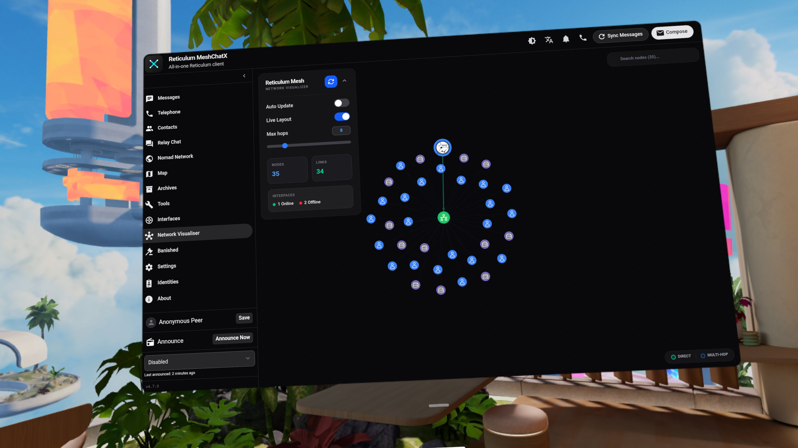

# MeshChatX on Meta Quest (Quest 2 and newer)

The MeshChatX Android APK runs on Meta Quest 2, Quest 3, Quest 3S, and Quest Pro. Quest headsets run a modified Android runtime, so the same universal APK published for phones and tablets can be installed by sideloading.

MeshChatX opens as a **2D panel** inside your VR environment. It is not a native VR application. You get the full MeshChatX web UI in a floating window while you remain in your Quest home space.

## What you need

- A Meta Quest 2 or newer headset
- A Meta account with **Developer Mode** enabled
- [SideQuest](https://sidequestvr.com/) on your PC (desktop app) or access to the SideQuest web installer
- A USB-C cable (for wired sideloading) or a working wireless ADB setup

## Get the APK

Download the latest signed Android APK from the [MeshChatX releases page](https://github.com/Quad4-Software/MeshChatX/releases). Release assets are named like `meshchatx-*-release-signed.apk`.

You can also build the APK yourself; see [`android/README.md`](../android/README.md).

## Enable Developer Mode

1. Install the Meta Horizon app on your phone and pair your headset.
2. Open **Menu** -> **Devices** -> select your headset -> **Developer Mode**.
3. Turn Developer Mode on and accept the prompt on the headset if asked.

Developer Mode is required for sideloading and for SideQuest to see the device.
